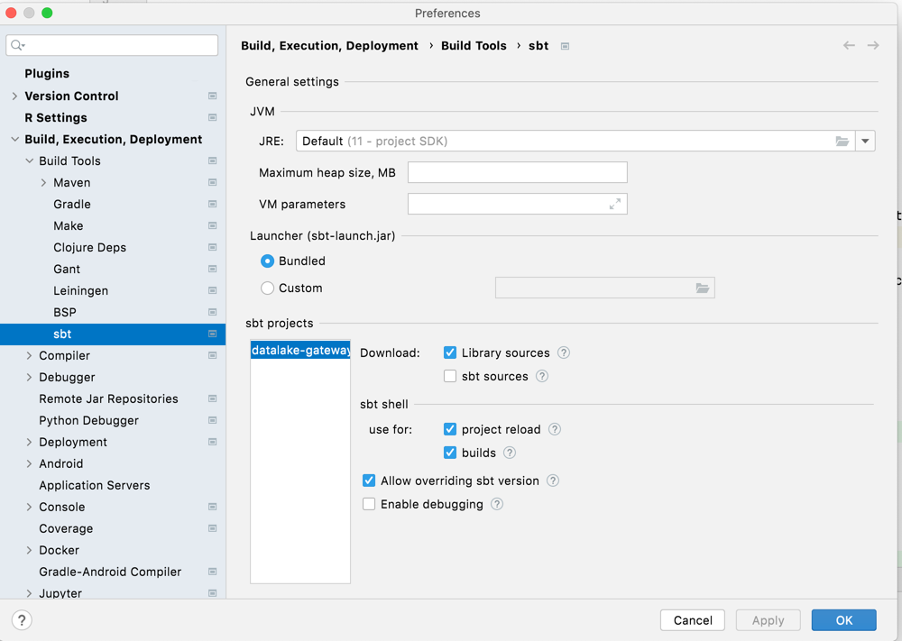
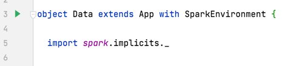

# Scala Spark Playground
This repository is used for creating test data in an S3 bucket.

## Create a bucket
1. Authenticate to AWS (save creds to default profile)
2. Run `./create-bucket <your-bucket-name>`

## Quickstart
1. Set your AWS Credentials

2. Make sure the following are checked in your Preferences > sbt settings:


3. Navigate to [Data.scala](./src/main/scala/Data.scala) and click the green run button in the gutter of IntelliJ


## Notes
Running this in IntelliJ is not the most portable solution but it is the easiest with respect to Scala/Spark versioning (instead of downloading the right deps to your computer).

## Future Notes: Running as spark-submit job
1. Ensure your computer has Spark (version 3.1.0) and Scala (version 2.12.8)

2. Modify the following library dependencies in `build.sbt`:
```scala
"org.apache.spark" %% "spark-core" % sparkVersion % "provided"
"org.apache.spark" %% "spark-sql" % sparkVersion % "provided"
```

3. Add to the bottom of `build.sbt`
```scala
ThisBuild / assemblyMergeStrategy := {
  case "org/apache/spark/unused/UnusedStubClass.class" => MergeStrategy.first
  case x =>
    val oldStrategy = (ThisBuild / assemblyMergeStrategy).value
    oldStrategy(x)
}
```

4. In sbt shell
```
compile
assembly
```

5. Set your AWS Credentials

6. Run the spark-submit job
```bash
spark-submit --class playground.Data target/scala-2.12/scala-spark-playground-assembly-0.1.jar 
```
